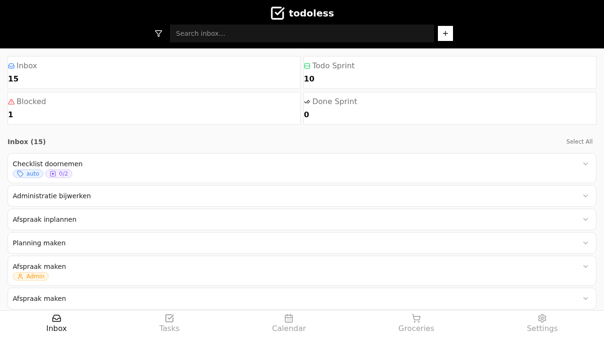
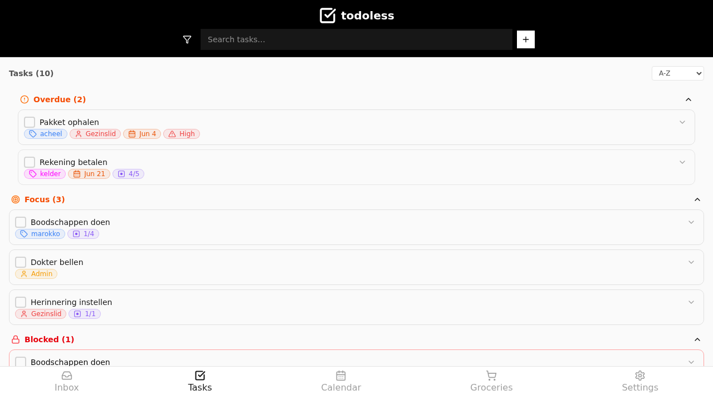
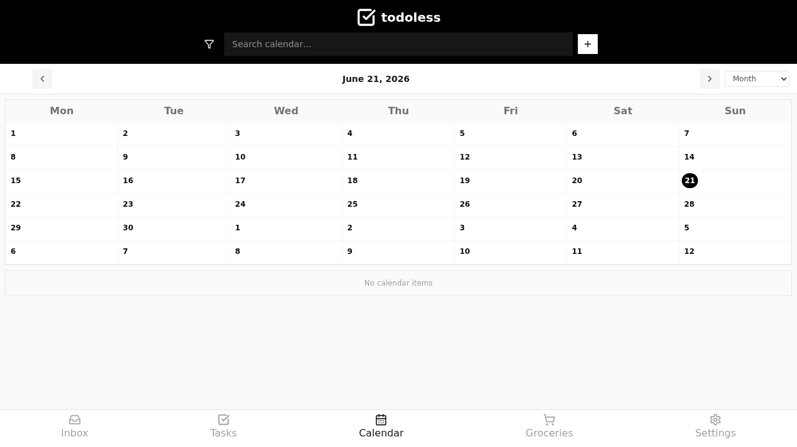
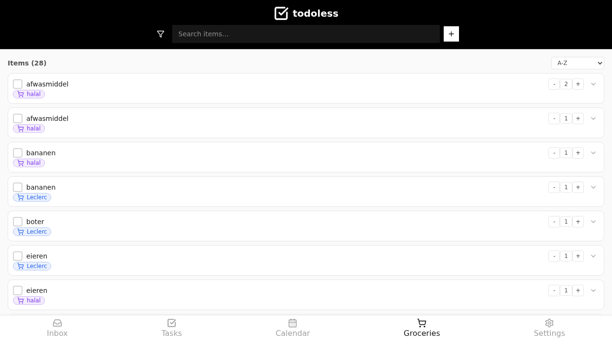
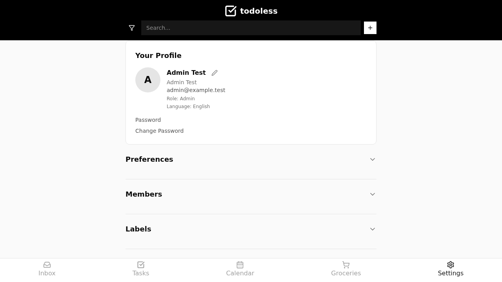

<div align="center">


# todoless

**The family organizer that keeps your data yours.**

Local-first · Self-hosted · Made in Europe · Free forever — no subscriptions, no paywalls.

[Why todoless](#-why-todoless) · [Quick Start](#-quick-start) · [Configuration](#-configuration) · [Security](#-running-securely) · [Roadmap](#-roadmap)

</div>

---

## Why todoless?

There are thousands of to-do apps. Almost none of them are built around **your privacy**. todoless is.

Family life is full of appointments, reminders and recurring patterns — groceries, school runs, swimming lessons, doctor visits. No app made that calm and clear *without* shipping your family's data to someone else's servers.

todoless is a small gift back to people who just want to organise daily life, on their own terms:

- 🔒 **Your data stays yours.** Self-hosted on your own machine. No tracking, no ads, no profiling.
- 🏠 **Local-first.** Runs on your own server — a Raspberry Pi, an old laptop, a NAS. You own the database.
- 🇪🇺 **Designed and built in Europe**, with data sovereignty as a first principle — not an afterthought.
- 🆓 **Free forever.** No subscriptions. No "premium" tier. Every feature is available to everyone, always.
- 👨‍👩‍👧‍👦 **Made for families.** Shared tasks, groceries, a calendar of everyone's appointments, and recurring routines — in one calm, mobile-first interface.
- 🧩 **Open and yours to shape.** Self-hosted and transparent; you can read the code that runs your family's data.

> todoless was never meant to be a million-dollar business. It's a contribution back — software that respects the people who use it.

---

## Screenshots

> *Replace these placeholders with real screenshots — see `docs/assets/`.*

| Inbox | Tasks | Calendar |
|---|---|---|
|  |  |  |

| Groceries | Week view | Settings |
|---|---|---|
|  |  |  |

---

## What you get

- **Inbox** — capture anything quickly; sort it later.
- **Tasks** — due dates, recurring patterns, labels, assignees, priorities, focus, subtasks.
- **Calendar** — every task with a date, visualised. Day / 3-day / Week / Work week / Month / Schedule views.
- **Groceries** — a shared shopping list with quantities and shops, for the whole household.
- **Multi-member** — one household, multiple people, shared and personal items. Invite-based onboarding.
- **Mobile-first** — built for phones, where family logistics actually happen.

---

## Quick Start

todoless runs as three Docker containers: **nginx frontend**, **PocketBase backend** (database + auth + API), and an optional **MCP server**. All orchestrated with Docker Compose.

### Requirements
- A machine that can run **Docker** and **Docker Compose** (Linux, Raspberry Pi 4+, NAS, or any always-on computer).
- ~5 minutes.

### 1. Clone
```bash
git clone https://github.com/ChalidNL/todoless.git
cd todoless
```

### 2. Create data directories
PocketBase needs persistent storage. Create the directories Docker will mount:
```bash
sudo mkdir -p /DATA/AppData/todoless/pb_data
sudo mkdir -p /DATA/AppData/todoless/pb_migrations
sudo mkdir -p /DATA/AppData/todoless/pb_hooks
```

> **Custom paths:** If you prefer different locations, edit `docker-compose.yml` and change the volume `source` paths before starting.

### 3. (Optional) Set up the MCP server
If you want the optional MCP integration, set the user token in your environment or `.env`:
```bash
export TODOLESS_USER_TOKEN="your-pocketbase-user-token"
```
Or create a `.env` file:
```bash
cp .env.example .env
# Edit .env and set TODOLESS_USER_TOKEN
```
> Skip this step if you don't need the MCP server — the app works without it.

### 4. Run
```bash
docker compose up -d
```
This pulls the pre-built images from GitHub Container Registry and starts everything.

### 5. Open
Visit **http://your-server-ip:7070**. On first run, you'll see the onboarding:
1. Choose your language
2. Create your admin account and name your household
3. Invite family members from Settings

---

## Configuration

### Port
The app is exposed on port **7070** by default. To change it, edit `docker-compose.yml`:
```yaml
ports:
  - target: 80
    published: 7070  # change this
```

### Volumes
All persistent data lives in `/DATA/AppData/todoless/`:

| Directory | Purpose |
|---|---|
| `pb_data/` | PocketBase database + file uploads |
| `pb_migrations/` | Schema migration scripts |
| `pb_hooks/` | Server-side API hooks |

### Environment (.env.example)
The `.env.example` file documents available variables. Not all are used by the production compose — the key ones for self-hosters:

| Variable | What it does |
|---|---|
| `TODOLESS_USER_TOKEN` | PocketBase user token for the MCP server (required for MCP) |
| `TODOLESS_MCP_READONLY` | Set to `false` to enable write tools in MCP (default: `true`) |
| `TZ` | Timezone (default: `Europe/Amsterdam`) |
| `WEBUI_PORT` | Port for the frontend (default: `7070`, must match compose) |

> Build-time variables (`VITE_POCKETBASE_URL`, `POCKETBASE_ADMIN_*`, SMTP settings) are used when building your own images — not needed when using the pre-built GHCR images.

---

## Updating

```bash
cd todoless
git pull
docker compose pull
docker compose up -d
```
PocketBase automatically applies new migrations on restart. Check the [releases page](https://github.com/ChalidNL/todoless/releases) for breaking changes before updating.

### Backups
Your data lives in a single PocketBase directory. Back it up:
```bash
# Stop PocketBase first for a clean backup
docker compose stop pocketbase
sudo cp -r /DATA/AppData/todoless/pb_data /backup/pb_data-$(date +%Y%m%d)
docker compose start pocketbase
```
> **Your data, your responsibility — and your control.**

---

## Running securely

todoless is meant to live on your own network. Here's how to access it safely:

### Option A: Tailscale (recommended for families)
Install [Tailscale](https://tailscale.com) on your server and your devices. Access todoless at `http://your-server:7070` — private, encrypted, nothing exposed to the internet.

### Option B: Reverse proxy + HTTPS
If you want a public domain, put todoless behind a reverse proxy with HTTPS:

| Proxy | Setup |
|---|---|
| **Caddy** | `your.domain { reverse_proxy localhost:7070 }` |
| **Traefik** | Add labels to the compose service |
| **nginx + Let's Encrypt** | Standard reverse proxy with certbot |

> ⚠️ **Important:** If you use a reverse proxy, configure it to terminate TLS. The todoless container only serves HTTP — do not expose port 7070 directly to the internet without HTTPS in front of it.

### Security hardening
- The PocketBase backend is not published to the host — only accessible internally via the nginx proxy.
- Frontend container runs **read-only** with minimal privileges.
- PocketBase container drops all capabilities except what it needs (`CHOWN`, `DAC_OVERRIDE`).
- Use `:latest` or `:dev` tags for convenience; pin to specific digests in production.
- Validate SMTP before going live (invite/password-reset emails).

---

## Tech stack
- **Frontend:** React 18 + Vite 6 + Tailwind CSS
- **Backend:** PocketBase 0.35 (SQLite + auth + REST API + realtime)
- **Deployment:** Docker Compose, pre-built GHCR images
- **Privacy:** everything runs on your hardware

---

## Roadmap
- [x] Multilingual UI (NL / FR / EN / DE / ES)
- [x] Calendar import/export (.ics)
- [ ] Recurring "family run" weekly planning ritual
- [ ] Push notifications (mobile)
- [ ] Companion mobile app (Android)

*See the [issues](https://github.com/ChalidNL/todoless/issues) for details.*

---

## Contributing
todoless is built in the open. Issues, ideas and pull requests are welcome. Because this is family data software, please keep **privacy and simplicity** front of mind in any contribution.

See [CONTRIBUTING.md](CONTRIBUTING.md) for guidelines.

---

## License
todoless is licensed under the **[GNU Affero General Public License v3.0](LICENSE)** (AGPL-3.0).

This keeps the code open and free — for everyone, forever. If you modify todoless and make it available over a network (including self-hosting modifications), you must share your changes under the same license. That's how we protect the community.

---

<div align="center">

**todoless** — organise family life, keep your privacy.
Made in Europe. Your data stays home.

</div>
