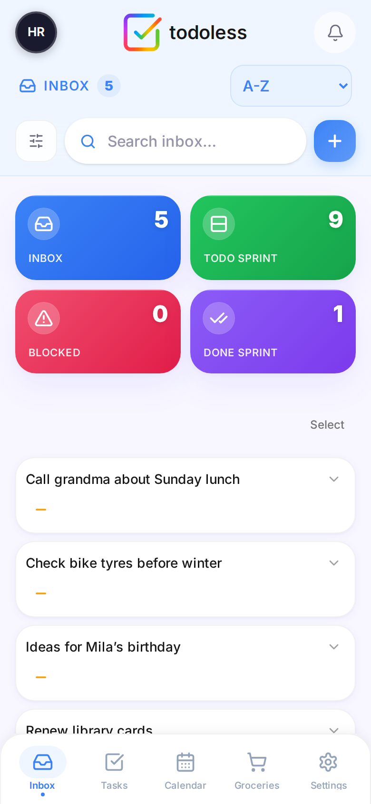
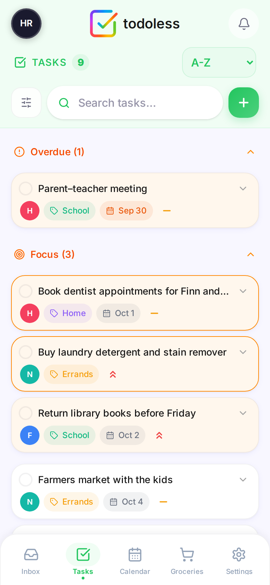
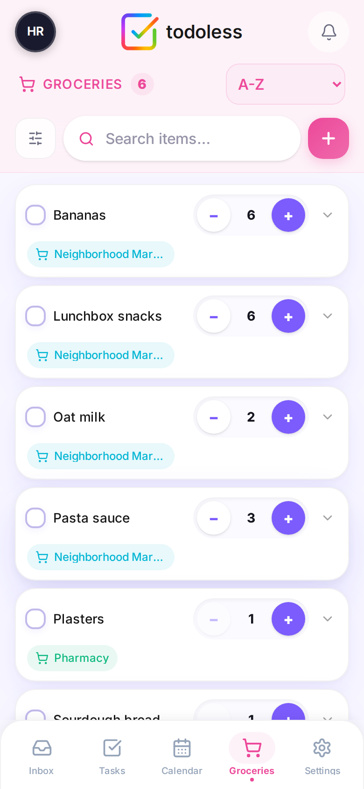
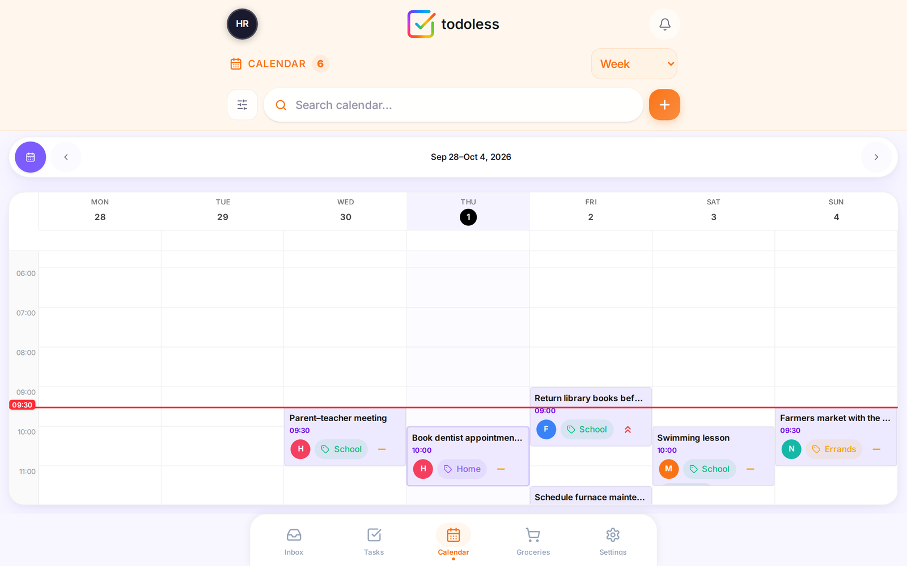

<div align="center">


# todoless

**Less managing. More living.**

The self-hosted family organizer for tasks, calendar and groceries.<br />
Your family. Your data.

[Website](https://todoless.eu) · [Install](#quick-start) · [Features](#features) · [Privacy](#privacy) · [API](#api-and-integrations) · [Releases](https://github.com/ChalidNL/todoless/releases)

Free & open source · Self-hosted · Made in Europe · v1.0.0

</div>

<p align="center">
  
  &nbsp;
  
  &nbsp;
  
</p>

---

## Why todoless?

The dentist appointment. The permission slip. What's for dinner on Thursday. In most families, one person carries all of it in their head.

todoless gives the whole household one calm, shared place for it, and it runs on **your own server**: a Raspberry Pi, an old laptop or a NAS. There is no account with us, no cloud service in between, and nothing to subscribe to.

- **Privacy first.** No telemetry, no ads, no profiling. Your household data stays on hardware you control.
- **Self-hosted.** Two Docker containers, about five minutes to set up.
- **Made for families.** Shared lists, assignees and roles, a family calendar and a shopping list, on a mobile-first interface.
- **Free and open source.** AGPL-3.0. Every feature is available to everyone, with no premium tier. You can read the code that runs your family's day.
- **Made in Europe.** Designed and built with data sovereignty as a starting point.

---

## Features

Everything below is available in **v1.0.0**.

**Capture: Inbox / Brain Dump**
- Type a thought, press Enter, and it's saved. Structure it later.
- Search, filter and sort the inbox; select several items at once.

**Structure: Tasks**
- Labels in your own colors, assignees, due dates, priorities, sub-tasks and a comment per task.
- Repeating tasks (daily, weekly, monthly…) create their next occurrence when you complete them.
- Mark tasks as focus or blocked. Overdue and focus tasks are grouped at the top.

**Focus: Todo Sprint**
- Pick the tasks that matter now from the inbox. They become your short Todo Sprint in Tasks, and the rest can wait.

**Together: family and roles**
- One household, shared by everyone. Invite members with a code or link; they join automatically.
- Roles: Owner, Admin, Member. Lists are shared with the household; labels can be private or shared with the family.
- Changes appear live on every signed-in device.

**Everyday life: calendar and groceries**
- Dated tasks become your calendar: Day, 3 days, Week, Work week, Month and Schedule views.
- Import and export `.ics` files, or subscribe from Apple Calendar, Google Calendar, Outlook or any other app that reads an ICS feed.
- A shared shopping list with quantities and shops you define, in your own colors. **Restock** brings ticked-off items back for next time.

**Your installation**
- An installable mobile-first PWA for phones, tablets and desktops.
- Interface in English, Dutch, German, French and Spanish.
- Daily automatic backups (PocketBase built-in, kept for 7 days).
- A documented REST API with scoped API tokens. See [API and integrations](#api-and-integrations).

<p align="center">
  
</p>

---

## Privacy

| | |
|---|---|
| **Where your data lives** | In a PocketBase (SQLite) database in `/DATA/AppData/todoless/pb_data` on your server. That's also where backups are stored. |
| **What leaves your server** | Nothing by default. The server only connects out when *you* configure it: e-mail through your own SMTP server, or backups to S3-compatible storage. Updating pulls new images from GitHub Container Registry. |
| **What your browser loads** | Only your own server. The shipped nginx sets a Content-Security-Policy that blocks scripts, styles, fonts and requests to any other host. There are no analytics, trackers or external fonts. |
| **Who can see what** | Members of your household see shared lists. Private labels stay with their owner. The admin dashboard (`/_/`) only answers on private networks. |
| **Calendar feed** | The subscription link contains a secret, read-only token. Anyone with the link can read the family calendar, so share it only with people you trust. You can revoke your links in Settings at any time. |

Keeping a self-hosted service safe is your responsibility: keep it updated and don't expose it to the internet without HTTPS (see [Running securely](#running-securely)).

---

## Quick start

todoless runs as two containers, started with Docker Compose:
- **todoless**: nginx with the web app.
- **pocketbase**: database, authentication and API.

**Requirements:** an always-on machine with Docker and Docker Compose (Linux, a Raspberry Pi 4 or newer, a NAS…).

### 1. Clone
```bash
git clone https://github.com/ChalidNL/todoless.git
cd todoless
```

### 2. Create the data directories
The PocketBase container runs as a fixed non-root user (uid 1000). Create its storage directories and give them to that user:
```bash
sudo mkdir -p /DATA/AppData/todoless/pb_data /DATA/AppData/todoless/pb_migrations /DATA/AppData/todoless/pb_hooks
sudo chown -R 1000:1000 /DATA/AppData/todoless
```
To store data somewhere else, change the three volume paths in `docker-compose.yml` first, and `chown` those paths instead.

### 3. Start
```bash
docker compose up -d
```
This pulls the published images from GitHub Container Registry. The first start takes a minute while the database is set up. `docker compose ps` shows both containers as `healthy` when they are ready.

### 4. Create your family
Open **http://your-server:7070** and follow the onboarding:
1. Choose your language.
2. Name your household.
3. Create the admin account.

Then invite your family from **Settings → Members**.

> **Optional:** copy `.env.example` to `.env` before step 3 to change the port, set your timezone, configure e-mail (for password resets) or create the PocketBase dashboard login. See [Configuration](#configuration).

---

## Configuration

All settings are optional. Put them in a `.env` file next to `docker-compose.yml`; `.env.example` documents every variable.

| Variable | Purpose |
|---|---|
| `TODOLESS_PORT` | Published web port (default `7070`) |
| `TZ` | Timezone for both containers (default `Europe/Amsterdam`) |
| `APP_URL` | Public address of your install, used in e-mail links (for example `https://todo.example.org`) |
| `SMTP_HOST`, `SMTP_PORT`, `SMTP_USERNAME`, `SMTP_PASSWORD`, `SMTP_FROM`, `SMTP_AUTH_METHOD` | Your SMTP server, used for password-reset e-mails. E-mail is enabled when `SMTP_HOST` is set. |
| `TRUSTED_PROXY_HEADERS`, `TRUSTED_PROXY_USE_LEFTMOST_IP` | Client-IP detection behind a reverse proxy (for example `X-Forwarded-For`) |
| `POCKETBASE_ADMIN_EMAIL`, `POCKETBASE_ADMIN_PASSWORD` | Create or update the PocketBase dashboard login on every start |
| `LOG_LEVEL` | Backend log verbosity: `info` (default), `warn`, `error` or `debug` |
| `MAIL_WEBHOOK_SECRET` | Shared secret for the optional inbound-mail webhook |
| `ENCRYPTION_KEY` | Optional, exactly 32 characters: encrypts the PocketBase settings (SMTP password, S3 and backup keys) inside the database. See [Settings encryption](#settings-encryption). |

`APP_NAME`, `APP_URL`, `SMTP_*` and `TRUSTED_PROXY_*` are applied to PocketBase **once**, on the first start. After that, change them in the PocketBase dashboard under **Settings**.

**Never commit your `.env` file**: it contains passwords.

### Settings encryption
PocketBase stores its settings, including the SMTP password and S3 keys, in `data.db`. These are stored in plain text unless you set `ENCRYPTION_KEY` to a random 32-character value, for example the output of `openssl rand -hex 16`. When the key is set, the next time settings are saved they are stored encrypted. A key of the wrong length is ignored with a warning in the log, and PocketBase then starts without encryption.

> ⚠️ **Keep the key with your backups.** Once settings have been saved encrypted, PocketBase will not start without the same key (`invalid settings db data or missing encryption key`). A backup of `pb_data` without the key cannot be fully restored, and if the key is lost, the encrypted settings cannot be recovered.

### Volumes

| Host directory | Contents |
|---|---|
| `/DATA/AppData/todoless/pb_data` | Database, uploaded files and backups |
| `/DATA/AppData/todoless/pb_migrations` | Database migrations (managed by the image) |
| `/DATA/AppData/todoless/pb_hooks` | Server-side API hooks (managed by the image) |

On every start, the container copies the bundled hooks and migrations into these directories. Files the app no longer ships are renamed to `<name>.gh35-removed-<timestamp>`, never deleted, and files you added yourself are never touched.

The database schema is owned by this repository. PocketBase starts with `--automigrate=false`, so a collection edit in the PocketBase dashboard changes the running database but does **not** write a `<timestamp>_updated_<collection>.js` file into `pb_migrations/`. Such files would re-run on every start and could collide with later bundled migrations. If an older install already has files like that in `pb_migrations/` (their names start with a 10-digit timestamp), review them and remove the ones you don't need before upgrading.

### Logs
Both containers log to stdout/stderr, so `docker compose logs`, Dozzle, Portainer or Loki pick them up. Request logs contain the method, route, status, duration and client IP; query strings, headers and bodies are never logged. Warnings and errors also appear in the PocketBase dashboard under **Logs** (kept for 5 days by default).

---

## Updating

```bash
cd todoless
git pull
docker compose pull
docker compose up -d
```
New database migrations are applied automatically when PocketBase restarts. Read the [release notes](https://github.com/ChalidNL/todoless/releases) before updating.

`docker-compose.yml` pins each image by digest, so an install only changes when you pull a new version of this repository. To follow a specific release instead, replace the `image:` lines with `ghcr.io/chalidnl/todoless-frontend:1.0.0` and `ghcr.io/chalidnl/todoless-pocketbase:1.0.0` (or `:1.0` for the latest 1.0.x).

<details>
<summary><b>Upgrading an install from before the non-root images (September 2026)</b></summary>

Since September 2026 both containers run as non-root users. Older installs have root-owned data directories, and PocketBase then stops with `[entrypoint] ERROR: /pb_data is not writable`. Fix the ownership once:

```bash
cd todoless
git pull
docker compose stop
sudo chown -R 1000:1000 /DATA/AppData/todoless/pb_data /DATA/AppData/todoless/pb_migrations /DATA/AppData/todoless/pb_hooks
docker compose pull
docker compose up -d
```
</details>

### Backups
PocketBase makes a consistent backup **every day at 02:00** and keeps the **last 7**. Backups are stored in `/DATA/AppData/todoless/pb_data/backups` and include the database and all uploaded files. In the PocketBase dashboard under **Settings → Backups** you can download or restore a backup, change the schedule, or copy backups to S3-compatible storage.

Never copy `data.db` while the app is running: recent changes live in a separate WAL file and would be lost. Use the built-in backup, or stop PocketBase first:
```bash
docker compose stop pocketbase
sudo cp -r /DATA/AppData/todoless/pb_data /backup/pb_data-$(date +%Y%m%d)
docker compose start pocketbase
```

---

## Running securely

todoless is meant to live on your own network. The container serves plain HTTP on port 7070, so **never expose that port directly to the internet**.

- **Private network (recommended for families):** install [Tailscale](https://tailscale.com) or WireGuard on the server and your devices, and open `http://your-server:7070` from anywhere. Nothing is exposed publicly.
- **Public domain:** put a reverse proxy with HTTPS in front, for example Caddy (`todo.example.org { reverse_proxy localhost:7070 }`), Traefik or nginx with Let's Encrypt. Set `APP_URL` to the public address, and set `TRUSTED_PROXY_HEADERS` so rate limiting sees real client IPs.

Built-in hardening:
- Both containers run as non-root, with all Linux capabilities dropped; the web container's filesystem is read-only.
- PocketBase is not published on the host. It is reachable only through nginx.
- Logins (including dashboard logins), registration and API calls are rate-limited per client. Spoofed `X-Forwarded-For` headers are ignored: PocketBase only trusts the address nginx adds itself.
- Strict security headers are set, including a Content-Security-Policy.

To report a vulnerability, see [SECURITY.md](SECURITY.md).

<details>
<summary><b>PocketBase admin dashboard</b></summary>

PocketBase's own dashboard at **http://your-server:7070/_/** gives access to the data, settings, backups and logs. It only answers **direct** requests from private networks (LAN, loopback and the Tailscale range). A request that arrives through a reverse proxy (it carries `X-Forwarded-For`, `Forwarded`, `X-Real-IP` or `CF-Connecting-IP`) gets `403`: behind a proxy, every visitor appears to come from the proxy's private address, so the allow-list could not tell the internet from your LAN. If you used to open the dashboard through your reverse proxy, open it directly on the LAN, via Tailscale or through an SSH tunnel instead.

Set `POCKETBASE_ADMIN_EMAIL` and `POCKETBASE_ADMIN_PASSWORD` in `.env` to create the dashboard login automatically, or create it once by hand:
```bash
docker compose exec pocketbase pocketbase superuser upsert admin@example.com 'a-long-unique-password'
```

To use the dashboard without any LAN exposure, publish PocketBase on the server's loopback only by adding `ports: ["127.0.0.1:8090:8090"]` to the `pocketbase` service. Then run `docker compose up -d pocketbase`, open an SSH tunnel (`ssh -L 8090:127.0.0.1:8090 user@your-server`) and browse to `http://127.0.0.1:8090/_/`. Remove the port line again when you're done.
</details>

---

## API and integrations

- **REST API:** every install documents its own API in Swagger UI at **`/api/docs`**, also linked from **Settings** in the app. The public reference is at **[todoless.eu/docs](https://todoless.eu/docs/)**.
- **API tokens:** for scripts and automations, create a scoped token (`tasks`, `groceries`, `calendar`; read, write or delete) with `POST /api/api-tokens` while signed in. The token is shown once and only its hash is stored. Wildcard scopes are reserved for owners and admins.
- **Calendar feed:** subscribe to `/api/calendar.ics` from any calendar app that supports ICS subscriptions (Apple, Google, Outlook, Thunderbird, Home Assistant's remote calendar…), or import and export `.ics` files.

---

## Tech stack

- **Frontend:** React 18, Vite 6, Tailwind CSS 4, an installable PWA.
- **Backend:** PocketBase 0.40, which provides SQLite, authentication, a REST API and realtime updates, extended with JavaScript hooks.
- **Deployment:** Docker Compose with multi-arch images (amd64, arm64) published to GitHub Container Registry.

## Roadmap

These ideas are **not** part of v1.0.0:
- A weekly "family run" planning ritual
- Push notifications on mobile
- A companion Android app

Follow progress and share ideas in the [issues](https://github.com/ChalidNL/todoless/issues).

## Contributing

Issues, ideas and pull requests are welcome. Because this is family data software, please keep **privacy and simplicity** front of mind. [CONTRIBUTING.md](CONTRIBUTING.md) explains the development setup, the quality checks and the migration rules.

## License

todoless is licensed under the [GNU Affero General Public License v3.0](LICENSE). If you modify todoless and offer it to others over a network, you must share your changes under the same license.

---

<div align="center">

**todoless** · Less managing. More living.<br />
Made in Europe · [todoless.eu](https://todoless.eu)

</div>
