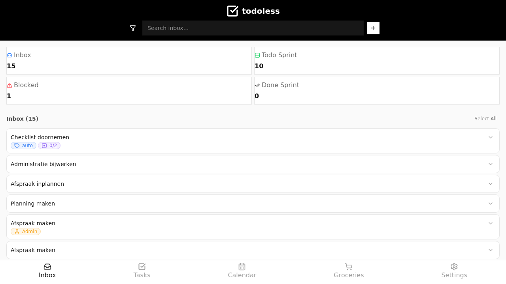
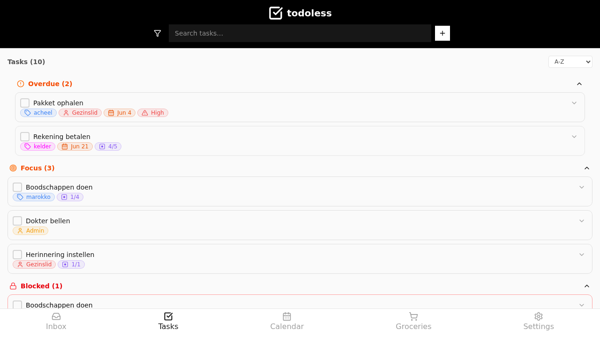
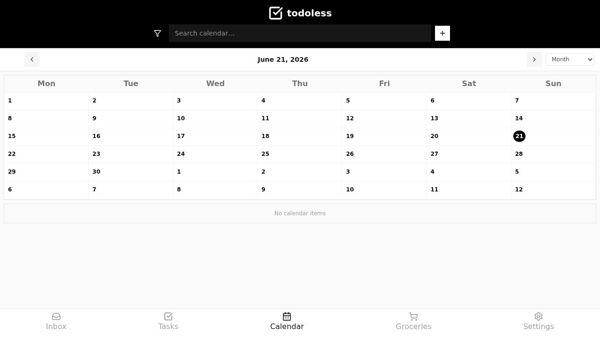
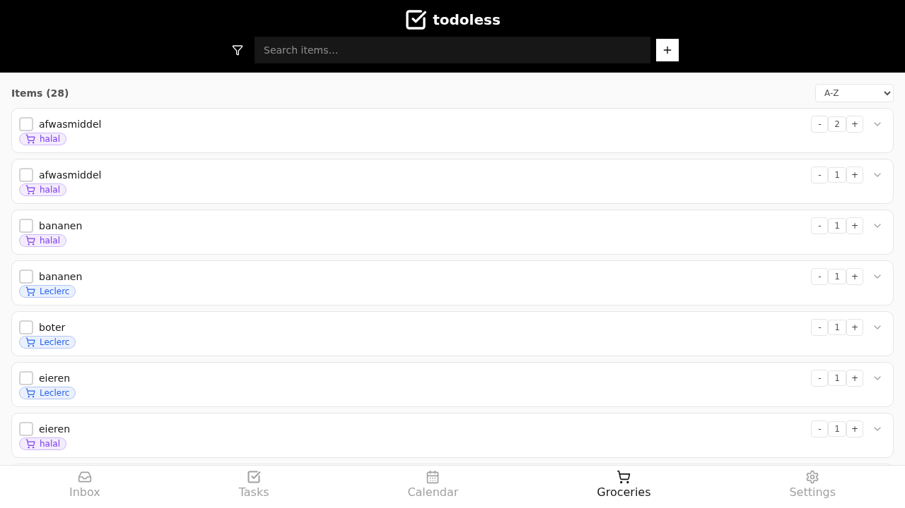
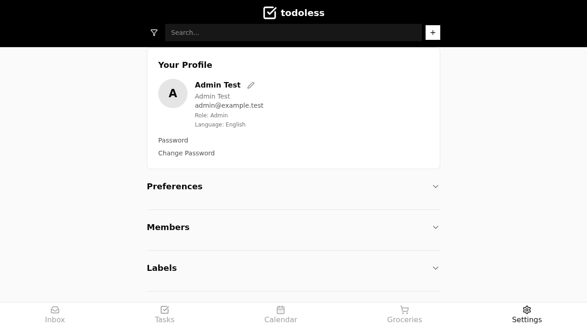

<div align="center">


# todoless

**The family organizer that keeps your data yours.**

Local-first · Self-hosted · Made in Europe · Free forever — no subscriptions, no paywalls.

[Why todoless](#-why-todoless) · [Quick Start](#-quick-start) · [Configuration](#-configuration) · [Security](#-running-securely) · [Roadmap](#-roadmap)

</div>

---

## Why todoless?

There are thousands of to-do apps. Almost none of them are built around **your privacy**. todoless is.

Family life is full of appointments, reminders and recurring patterns — groceries, school runs, swimming lessons, doctor visits. No app made that calm and clear *without* shipping your family's data to someone else's servers.

todoless is a small gift back to people who just want to organise daily life, on their own terms:

- 🔒 **Your data stays yours.** Self-hosted on your own machine. No tracking, no ads, no profiling.
- 🏠 **Local-first.** Runs on your own server — a Raspberry Pi, an old laptop, a NAS. You own the database.
- 🇪🇺 **Designed and built in Europe**, with data sovereignty as a first principle — not an afterthought.
- 🆓 **Free forever.** No subscriptions. No "premium" tier. Every feature is available to everyone, always.
- 👨‍👩‍👧‍👦 **Made for families.** Shared tasks, groceries, a calendar of everyone's appointments, and recurring routines — in one calm, mobile-first interface.
- 🧩 **Open and yours to shape.** Self-hosted and transparent; you can read the code that runs your family's data.

> todoless was never meant to be a million-dollar business. It's a contribution back — software that respects the people who use it.

---

## Screenshots

| Inbox | Tasks | Calendar |
|---|---|---|
|  |  |  |

| Groceries | Week view | Settings |
|---|---|---|
|  |  |  |

---

## What you get

- **Inbox** — capture anything quickly; sort it later.
- **Tasks** — due dates, recurring patterns, labels, assignees, priorities, focus, subtasks.
- **Calendar** — every task with a date, visualised. Day / 3-day / Week / Work week / Month / Schedule views.
- **Groceries** — a shared shopping list with quantities and shops, for the whole household.
- **Multi-member** — one household, multiple people, shared and personal items. Invite-based onboarding.
- **Mobile-first** — built for phones, where family logistics actually happen.

---

## Quick Start

todoless runs as two Docker containers: **nginx frontend** and **PocketBase backend** (database + auth + API), orchestrated with Docker Compose.

### Requirements
- A machine that can run **Docker** and **Docker Compose** (Linux, Raspberry Pi 4+, NAS, or any always-on computer).
- ~5 minutes.

### 1. Clone
```bash
git clone https://github.com/ChalidNL/todoless.git
cd todoless
```

### 2. Create data directories
PocketBase needs persistent storage. Create the directories Docker will mount:
```bash
sudo mkdir -p /DATA/AppData/todoless/pb_data
sudo mkdir -p /DATA/AppData/todoless/pb_migrations
sudo mkdir -p /DATA/AppData/todoless/pb_hooks
```
The PocketBase container runs as a fixed non-root user (uid 1000), so the
directories must be owned by that user:
```bash
sudo chown -R 1000:1000 /DATA/AppData/todoless/pb_data /DATA/AppData/todoless/pb_migrations /DATA/AppData/todoless/pb_hooks
```

> **Custom paths:** If you prefer different locations, edit `docker-compose.yml` and change the volume `source` paths before starting, and chown those paths to uid 1000 as above.

### 3. Run
```bash
docker compose up -d
```
This pulls the pre-built images from GitHub Container Registry and starts everything.

### 4. Open
Visit **http://your-server-ip:7070**. On first run, you'll see the onboarding:
1. Choose your language
2. Create your admin account and name your household
3. Invite family members from Settings

---

## Configuration

### Port
The app is exposed on port **7070** by default. To change it, set `TODOLESS_PORT` in `.env` (see `.env.example`):
```yaml
# docker-compose.yml (no edit needed)
ports:
  - target: 8080
    published: "${TODOLESS_PORT:-7070}"
```
```bash
# .env
TODOLESS_PORT=8080
```

### Volumes
All persistent data lives in `/DATA/AppData/todoless/`:

| Directory | Purpose |
|---|---|
| `pb_data/` | PocketBase database + file uploads |
| `pb_migrations/` | Schema migration scripts |
| `pb_hooks/` | Server-side API hooks |

On every start the entrypoint seeds the bundled hooks/migrations into these volumes and prunes app-managed files that were renamed or removed upstream (and files from newer images when downgrading), so stale hooks stop running and removed migrations never re-apply (GH#35). Pruned files are preserved as `<name>.gh35-removed-<timestamp>` instead of deleted, so a locally customized copy is never destroyed; the suffix is ignored by PocketBase, and directories are never touched. User-added files are never touched at all; the append-only manifests `app-managed-migrations.txt` / `app-managed-hooks.txt` list every file the app has ever seeded and are enforced by CI. Once you have confirmed you no longer need a preserved copy, you can delete any `*.gh35-removed-*` file from `pb_migrations/` or `pb_hooks/`.

The schema is owned by the repository: PocketBase starts with `--automigrate=false`, so a collection edit made in the PocketBase dashboard (or through the superuser API) changes the running database but does **not** write a `<timestamp>_updated_<collection>.js` file into `pb_migrations/`. Such generated files would be invisible to the repository's migration gates, re-run on every start and collide with later bundled migrations (a duplicate field or collection makes PocketBase refuse to start). If an older install already has files like that in `pb_migrations/` — their names start with a 10-digit timestamp — review them and remove the ones you don't need before upgrading; bundled migrations are applied on start either way.

### Environment (.env.example)
The `.env.example` file documents available variables. Not all are used by the production compose — the key ones for self-hosters:

| Variable | What it does |
|---|---|
| `TZ` | Timezone (default: `Europe/Amsterdam`, hardcoded in compose) |
| `TODOLESS_PORT` | Published web port, read by compose (default: `7070`, see `.env.example`) |
| `LOG_LEVEL` | Backend logging verbosity on stdout/stderr (default: `info`) — see below |
| `POCKETBASE_ADMIN_EMAIL` | PocketBase superuser email - set together with the password to auto-create the dashboard login on start (optional) |
| `POCKETBASE_ADMIN_PASSWORD` | PocketBase superuser password - set together with the email (optional) |
| `MAIL_WEBHOOK_SECRET` | Inbound mail webhook shared secret, sent as Bearer token by your mail provider; webhook fails closed with 503 if unset |
| `APP_NAME`, `APP_URL` | PocketBase app name / public URL (used in e-mails) — applied once by the settings bootstrap (GH#51) |
| `SMTP_*` | SMTP server for verification/password-reset e-mails — SMTP is enabled when `SMTP_HOST` is set; applied once by the settings bootstrap (GH#51) |
| `TRUSTED_PROXY_*` | Trusted proxy headers for client-IP detection behind a reverse proxy — applied once by the settings bootstrap (GH#51) |

> Runtime settings bootstrap (GH#51): `APP_NAME`, `APP_URL`, `SMTP_*` and `TRUSTED_PROXY_*` are read by docker-compose.yml and applied to PocketBase settings **once** by migration `z067` on first start — fresh installs and upgrades alike. Afterwards the admin Dashboard is the source of truth. `VITE_*` remain build-time only; `POCKETBASE_ADMIN_*` are read by the container entrypoint (see [Accessing the PocketBase dashboard](#accessing-the-pocketbase-dashboard-admin)) to upsert the dashboard superuser on start (GH#50).

### Logging & observability
The PocketBase container writes structured, single-line request logs to **stdout/stderr**, which any Docker log setup (Loki/promtail, Dozzle, Portainer, `docker logs`) picks up automatically:

```
[pb-request] ts=2026-09-28T10:45:19Z level=info method=GET path=/api/entries status=200 duration_ms=3 ip=192.168.2.10 auth=abc123
[pb-request] ts=2026-09-28T10:45:19Z level=warn method=POST path=/api/invites/create status=401 duration_ms=1 ip=192.168.2.10 auth=-
```

- `level=info` → stdout · `level=warn`/`level=error` → stderr · `path` is the route only (query string, headers and bodies are **never** logged).
- 4xx/5xx lines are also mirrored into PocketBase's own log store (`auxiliary.db` → `_logs`) via `$app.logger()`, so they show up in the admin dashboard (and can be shipped via the superuser API `GET /api/logs/request`).
- Unhandled errors thrown by custom routes are logged (`level=error ... error="..."`) instead of being silently swallowed.
- `LOG_LEVEL` controls verbosity: `info` (default) logs everything · `warn`/`error` only logs warnings/errors · `debug`/`trace` adds PocketBase's own `--dev` output (console logs + SQL) to the same streams.
- Log retention in `_logs` defaults to 5 days — adjust under **Settings → Logs** in the admin dashboard if you need longer history.

---

## Updating

```bash
cd todoless
git pull
docker compose pull
docker compose up -d
```
PocketBase automatically applies new migrations on restart. Check the [releases page](https://github.com/ChalidNL/todoless/releases) for breaking changes before updating.

### Updating to the non-root images (GH#45)

Since the 2026-09-28 release both containers run as **non-root** users: the
frontend as uid 101 (`nginx-unprivileged`) and PocketBase as uid 1000. If you
are upgrading an install that was created before that release, your storage
directories are still owned by root and PocketBase will refuse to start until
they are migrated **once**:

```bash
cd todoless
git pull
docker compose stop
sudo chown -R 1000:1000 /DATA/AppData/todoless/pb_data \
    /DATA/AppData/todoless/pb_migrations \
    /DATA/AppData/todoless/pb_hooks
docker compose pull
docker compose up -d
```

Fresh installs (see [Quick Start](#-quick-start)) already chown the directories
during setup, so no extra step is needed there. The command is safe to rerun.

> If after `docker compose up -d` the `pocketbase` container is **restarting**
> (crash loop) with `[entrypoint] ERROR: /pb_data is not writable` in
> `docker compose logs pocketbase`, the volumes are still root-owned — run the
> `chown` block above once and `docker compose up -d` again.

### Backups

PocketBase's built-in backup is enabled by default: it creates a **consistent zip snapshot every day at 02:00** (server time) and **keeps the last 7 backups**. Backups live in `pb_data/backups` (on the host: `/DATA/AppData/todoless/pb_data/backups`) and include the database plus all uploaded files. Download or restore them under **Settings → Backups** in the admin dashboard — you can also change the schedule/retention or mirror backups to S3-compatible storage there.

> ⚠️ **Never copy the database while the app is running.** PocketBase uses SQLite in WAL mode: while the app is up there is a `data.db-wal` file holding the most recent writes, so copying `data.db` alone silently loses the last transactions. Use the built-in backup above (transaction-safe, runs while the app is up) or the offline recipe below (stopping PocketBase checkpoints the WAL first):
```bash
# Manual alternative: stop PocketBase first for a clean copy
docker compose stop pocketbase
sudo cp -r /DATA/AppData/todoless/pb_data /backup/pb_data-$(date +%Y%m%d)
docker compose start pocketbase
```
> **Your data, your responsibility — and your control.**

---

## Running securely

todoless is meant to live on your own network. Here's how to access it safely:

### Option A: Tailscale (recommended for families)
Install [Tailscale](https://tailscale.com) on your server and your devices. Access todoless at `http://your-server:7070` — private, encrypted, nothing exposed to the internet.

### Option B: Reverse proxy + HTTPS
If you want a public domain, put todoless behind a reverse proxy with HTTPS:

| Proxy | Setup |
|---|---|
| **Caddy** | `your.domain { reverse_proxy localhost:7070 }` |
| **Traefik** | Add labels to the compose service |
| **nginx + Let's Encrypt** | Standard reverse proxy with certbot |

> ⚠️ **Important:** If you use a reverse proxy, configure it to terminate TLS. The todoless container only serves HTTP — do not expose port 7070 directly to the internet without HTTPS in front of it.

### Security hardening
- **Reporting vulnerabilities:** see [SECURITY.md](SECURITY.md) for supported versions and how to privately report a vulnerability.
- The PocketBase backend is not published to the host - only accessible internally via the nginx proxy. The admin dashboard at `/_/` is allow-listed to private networks only (see below).
- Frontend container runs as an unprivileged Nginx user (uid 101) in a **read-only** filesystem with all capabilities dropped (`cap_drop: ALL`).
- PocketBase container runs as a fixed non-root user (uid 1000) with all capabilities dropped (`cap_drop: ALL`, no `cap_add`).
- Use `:latest` for quick trials; pin a release tag, commit SHA tag, or digest in production.
- Validate SMTP before going live (invite/password-reset emails).

### Accessing the PocketBase dashboard (admin)

PocketBase ships its own admin dashboard at `/_/` (collections, settings, backups, `_logs`, user recovery). It is reachable at **http://your-server-ip:7070/_/**, but only from private networks: the shipped nginx allow-lists RFC1918 LAN ranges, loopback and the Tailscale CGNAT range (`100.64.0.0/10`), and answers `403` for everyone else. Never expose the app port to the public internet.

**1. Superuser (usually automatic)**

The web onboarding only creates an app admin. The PocketBase superuser is bootstrapped automatically if you set both `POCKETBASE_ADMIN_EMAIL` and `POCKETBASE_ADMIN_PASSWORD` in `.env` before `docker compose up -d` - the container entrypoint runs `pocketbase superuser upsert` on every start (idempotent, so updating the password later is just editing `.env` and recreating the container).

**Manual alternative** (no `.env`): on the server, with the stack running:

```bash
docker compose exec pocketbase pocketbase superuser upsert admin@example.com 'a-very-strong-password'
```

> The command writes to the same `pb_data` database the server uses. If you created a superuser manually, keep the same email/password in `.env` so the entrypoint keeps it in sync.

**2. If you prefer zero LAN exposure (SSH tunnel only)**

1. Temporarily publish PocketBase to the host's loopback interface only. In `docker-compose.yml`, under the `pocketbase` service add:
   ```yaml
   ports:
     - "127.0.0.1:8090:8090"
   ```
2. Recreate the container: `docker compose up -d pocketbase`
3. From your workstation, tunnel into it: `ssh -L 8090:127.0.0.1:8090 user@your-server`
4. Open **http://127.0.0.1:8090/_/** on your workstation and sign in with the superuser.
5. When finished, remove the two lines you added and `docker compose up -d pocketbase` - the dashboard is unreachable again.

Binding to `127.0.0.1` (not `0.0.0.0`) keeps the port off your LAN; only the SSH tunnel can reach it.

---

## Tech stack
- **Frontend:** React 18 + Vite 6 + Tailwind CSS
- **Backend:** PocketBase 0.40 (SQLite + auth + REST API + realtime)
- **Deployment:** Docker Compose, pre-built GHCR images
- **Privacy:** everything runs on your hardware

---

## Roadmap
- [x] Multilingual UI (NL / FR / EN / DE / ES)
- [x] Calendar import/export (.ics)
- [ ] Recurring "family run" weekly planning ritual
- [ ] Push notifications (mobile)
- [ ] Companion mobile app (Android)

*See the [issues](https://github.com/ChalidNL/todoless/issues) for details.*

---

## Contributing
todoless is built in the open. Issues, ideas and pull requests are welcome. Because this is family data software, please keep **privacy and simplicity** front of mind in any contribution.

See [CONTRIBUTING.md](CONTRIBUTING.md) for guidelines.

---

## License
todoless is licensed under the **[GNU Affero General Public License v3.0](LICENSE)** (AGPL-3.0).

This keeps the code open and free — for everyone, forever. If you modify todoless and make it available over a network (including self-hosting modifications), you must share your changes under the same license. That's how we protect the community.

---

<div align="center">

**todoless** — organise family life, keep your privacy.
Made in Europe. Your data stays home.

</div>
